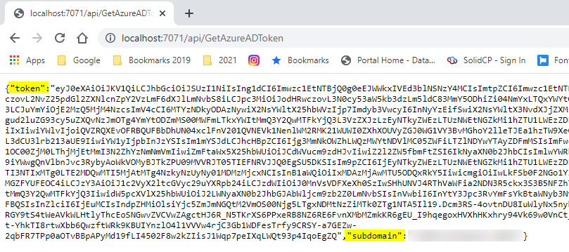
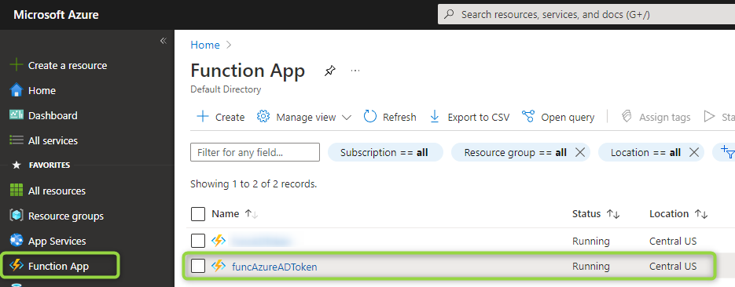
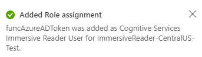

# Immersive Reader - Azure Function C# Sample

This function returns an Azure AD token in order to call an Immersive Reader resource. It works based on Azure Managed Identities.

## Prerequisites

* An Immersive Reader resource configured for Azure Active Directory authentication. Follow [these instructions](https://docs.microsoft.com/azure/cognitive-services/immersive-reader/how-to-create-immersive-reader) to get set up. You will need some of the values created here when configuring the sample project properties. Save the output of your session into a text file for future reference.
* [Visual Studio Code](https://code.visualstudio.com/).
* [Azure Account](https://marketplace.visualstudio.com/items?itemName=ms-vscode.azure-account) extension.
* [Azure Functions](https://marketplace.visualstudio.com/items?itemName=ms-azuretools.vscode-azurefunctions) extension.

## Usage

1. Open **AzureFunction-csharp** folder in VSCode.

2. Install the required dependencies using VSCode Terminal.

    > dotnet add package Microsoft.Azure.Services.AppAuthentication --version 1.6.1

3. Replace the `<subdomain>` place holder into **ManagedIdentityAzureADTokenProvider.cs**. Subdomain value is generated when creating your Immersive Reader resource as described in the **Prerequisites** section.

4. Run the command below to test the function locally.

    > func host start

    

5. This will start a local development server on port 7071. Browse to `http://localhost:7071/api/GetAzureADToken` and you will see an Azure AD token displayed on the page.

    

## Deploy Function into Azure

1. Click on the Azure extension, and then **Deploy to Function App..**.

    

2. Select the first option to **Create new Function App in Azure…** 

    Make sure it is NOT the **Advanced**.

    

3. You must enter a unique globally name for the function. 

    An error will be shown in case it already exists.

    

4. Select the runtime stack .Net 5

    

5. Select the region where your function is going to be deployed.

    

6. The function is being created on Azure now. 

    You will see the status on the bottom right corner of VS Code and a confirmation message when completed.

    

7. Go to your subscription.

    Expand your function > **Functions**.
    
    Right-click over your function name and click on **Copy Function Url**.

    

8. This is the URL to be used in your apps to call this function. 

    It includes a `code` param that can be passed either in the querystring parameters or in the request header.

    > Example: https://funcazureadtoken.azurewebsites.net/api/getazureadtoken?code=[YOUR_FUNCTION_SECRET_APIKEY]

    `code` is an API key assigned by default to your function 

    See the code samples below to see how the Azure function is called.

    •	[.Net / C#](https://github.com/microsoft/immersive-reader-sdk/tree/master/js/samples/quickstart-csharp-azfunction)
    
    •	[Android / Kotlin](https://github.com/microsoft/immersive-reader-sdk/tree/master/js/samples/quickstart-kotlin-azfunction)
    
    •	iOS / React Native.

## CORS

1. Log in into Azure portal.

2. Go to Function App on the left panel and select your function from the list.

    

3. Scroll down until **CORS** option and click on it.

    Add all the allowed origins for this function. 
    
    This config is needed when the callers are web applications.

    Example values are `https://localhost:44347` when you call it from your local host server in .Net, or `https://localhost:3000` when called from a local NodeJS app.

    

## Configure Managed Identities

Follow the next steps to add permissions to your Immersive Reader resource for the Managed identities. This allowas the Azure AD tokens acquired by the MI to work with your IR resource.

1. Scroll down until **Identity** option and click on it.

2. Make sure you have selected the **System assigned** tab.

    Set **Status On** and click on **Save**.

    

3. You will get a confirmation dialog box, click Yes.

    

4. Go to the **Search resources** textbox in the top of the Azure portal.

    Search for **Immersive Reader** resource and click on the listed resource.

    

5. Select the option **Access control (IAM)** from the left panel, click on **Add** and then **Add role assignment**.

    

6. Select **Cognitive Services User** role and press **Next**.

    

7. Select **Managed identity** in the **Assign access to** option and then press **+ Select members**.

    Specify the values below for the options displayed on the right.

    **Managed identity**: Function App
    
    **Select**: click on your function name. After this your function must be added into **Selected members:**.

    Press **Select**.

    

8. Your function info is displayed now.

    Press **Review + assign**.

    

7. Confirmation message is displayed when the role is assigned.

    

## See also

* [About Azure Functios](https://docs.microsoft.com/en-us/azure/azure-functions/functions-overview)
* [Create first function C#](https://docs.microsoft.com/en-us/azure/azure-functions/create-first-function-vs-code-csharp?tabs=in-process&pivots=programming-runtime-functions-v3)
* [Running functions on .NET 5.0 in Azure](https://docs.microsoft.com/en-us/azure/azure-functions/dotnet-isolated-process-guide)

## License

Copyright (c) Microsoft Corporation. All rights reserved.

Licensed under the MIT License.
