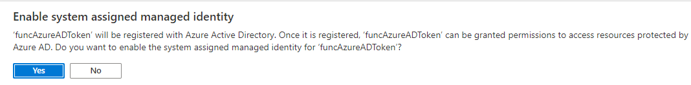

# Immersive Reader - Azure Function C# Sample

This function returns an Azure AD token in order to call an Immersive Reader resource. It works based on Azure Managed Identities.

## Prerequisites

* An Immersive Reader resource configured for Azure Active Directory authentication. Follow [these instructions](https://docs.microsoft.com/azure/cognitive-services/immersive-reader/how-to-create-immersive-reader) to get set up. You will need some of the values created here when configuring the sample project properties. Save the output of your session into a text file for future reference.
* [Visual Studio Code](https://code.visualstudio.com/).
* [Azure Account](https://marketplace.visualstudio.com/items?itemName=ms-vscode.azure-account) extension.
* [Azure Functions](https://marketplace.visualstudio.com/items?itemName=ms-azuretools.vscode-azurefunctions) extension.

## Usage

1. Open **AzureFunction-csharp** folder in VSCode.

2. Install the required dependencies using VSCode Terminal.

    > dotnet add package Microsoft.Azure.Services.AppAuthentication --version 1.6.1

3. Replace the `<subdomain>` place holder into **getADTokenNet.cs**, it should be the same generated in **Prerequisites** section.

4. Run the command below to test the function locally.

    > func host start

    

5. It will start a local development server on port 7071, try accesing `http://localhost:7071/api/getADTokenNet` in your browser and you will see an AD token render on page.

    

## Deploy Function into Azure

1. Click on the Azure extension, and then **Deploy to Function App..**.

    

2. Select the first option to **Create new Function App in Azure…** make sure it is NOT the **Advanced**.

    

3. You must enter a unique globally name for the function, an error will be shown in case it already exists.

    

4. Select the runtime stack .Net Core 3.1

    

5. Select the region where your function is going to be deployed.

    

6. The function is being created on Azure now, you will see the status on the bottom right corner of VS Code and a confirmation message when completed.

    

7. Go to your subscription, expand your function > **Functions** and right click over your function name and click on **Copy Function Url**.

    

8. This value copied is the URL to be used in your apps to call this function, it includes a `code` param that can be passed either in the querystring parameters or in the request header.

    > Example: https://funcadtoken.azurewebsites.net/api/getadtokennet?code=JC64NBXjg6U9CarjJaJxbBqhFjHBlaUPNDa2btCMxFGVwe24B1E8EQ%3D%3D

    See the code samples below to see how the Azure function is called.

    •	[.Net / C#](https://github.com/microsoft/immersive-reader-sdk/tree/master/js/samples/quickstart-csharp-azfunction)
    
    •	[Android / Kotlin](https://github.com/microsoft/immersive-reader-sdk/tree/master/js/samples/quickstart-kotlin-azfunction)
    
    •	iOS / React Native.

## CORS

1. Log in into Azure portal.

2. Go to Function App on the left panel and select your function from the list.

    

3. Scroll down until **CORS** option, click on it and list all the allowed origins for this function. This config is needed when the callers are web applications.

    

## Configure Managed Identities

1. Scroll down until **Identity** option and click on it.

2. Make sure you are into **System assigned** tab, set **Status On** and click on **Save**.

    

3. You will get a confirmation dialog box, click Yes.

    

4. Search for **Immersive Reader** resource, click on the listed resource.

    

5. Select the option **Access control (IAM)** from the left panel, click on **Add** and then **Add role assignment**.

    

6. Specify the values below for the options displayed on the right and press **Save**.
    
    Role: Cognitive Services Data Reader (Preview).
    Assign access to: Function app
    Select: click on your function name.

    

7. Repeat steps 5 and 6 but now for role **Cognitive Services User**.

## License

Copyright (c) Microsoft Corporation. All rights reserved.

Licensed under the MIT License.
