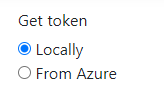

# Immersive Reader - Quickstart C# calling Azure Function

This code sample shows how to get Azure AD token from an Azure function.

## Prerequisites

* A function already created and deployed into Azure, see this [Azure function code sample](https://github.com/microsoft/immersive-reader-sdk/tree/master/js/samples/azure-function-csharp).

    You must have the Azure function code sample setup and running to get the `YOUR_FUNCTION_LOCAL` value to be used in the next section.

    Follow the steps in the sample and run the function either pressing **F5** or with the command below:

    > func host start

    You must deploy the function to Azure first to get the `YOUR_FUNCTION_URL` value. Please see the same code sample, and go to **Deploy Function into Azure** section into **Readme.md** file.

* [Visual Studio 2002](https://visualstudio.microsoft.com/downloads)

## Usage

1. Open **quickstart-csharp-azfunction.sln** in Visual Studio.

2. Right-click on the project in the Solution Explorer and choose **Manage User Secrets**. This will open a file called `secrets.json`. Replace the contents of that file with the following, supplying your values as appropriate either if your function is running locally or is deployed into Azure:

    ```json
    {
      "FunctionDeployedToAzureUrl": "YOUR_FUNCTION_URL",
      "FunctionAPIKey": "YOUR_FUNCTION_APIKEY",
      "FunctionDeployedLocallyUrl": "YOUR_FUNCTION_LOCAL"
    }
    ```

3. Build the solution from the `Build > Build Solution` menu.

4. Select the option to get the token. Make sure to have the function either running locally or deployed to Azure, according to how you've chosen to deploy the function.

    

## Disclaimer

This approach is for development purposes only and is not how this should be used in Production.

That Production auth is beyond the scope of this sample.

* [Function Access Keys](https://docs.microsoft.com/en-us/azure/azure-functions/functions-bindings-http-webhook-trigger?tabs=csharp#authorization-keys)

## License

Copyright (c) Microsoft Corporation. All rights reserved.

Licensed under the MIT License.
